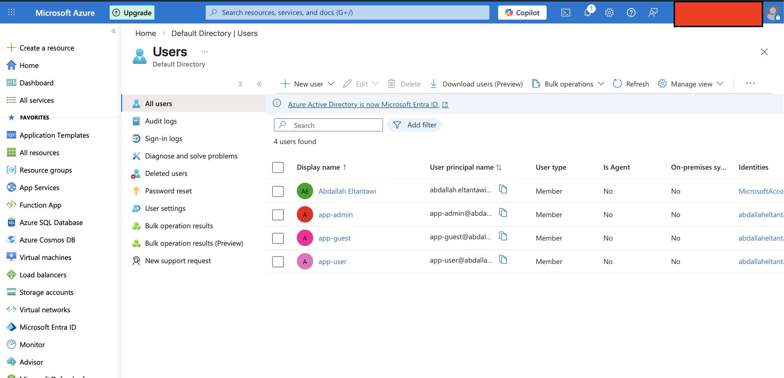
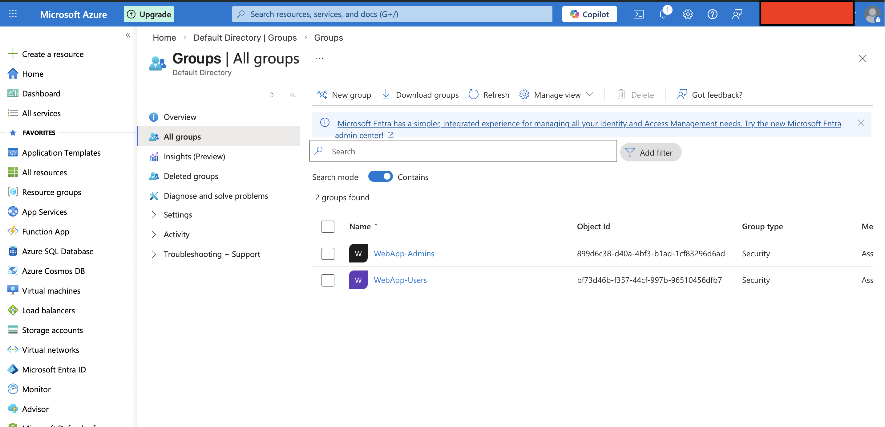
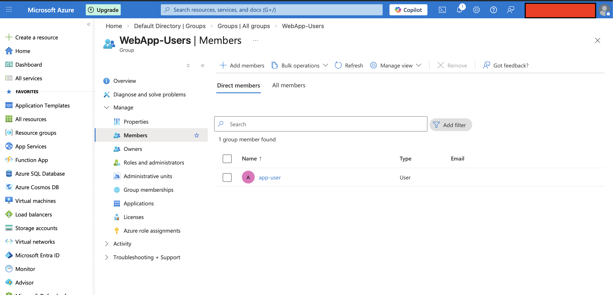
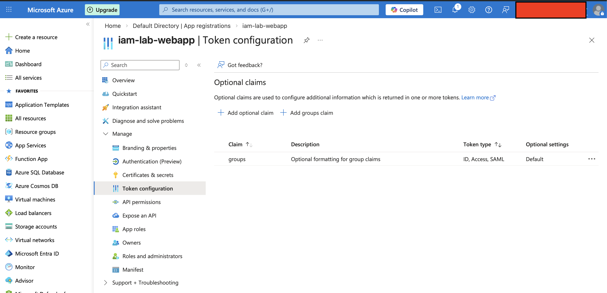

# Lab 1 – Secure Web App with Microsoft Entra ID

## Objective

Deploy a web application in Azure and secure access using Microsoft Entra ID authentication.

This lab demonstrates how modern cloud applications are protected using centralized identity providers and token-based authentication.

---

## Technologies Used

- Microsoft Azure
- Microsoft Entra ID
- OAuth 2.0 Authentication
- Azure App Service

---

## Architecture

User → Microsoft Entra ID → OAuth Token → Azure Web App

Users must authenticate through Microsoft Entra ID before accessing the application.

---

## Authentication Flow

1. User accesses the web application  
2. The application redirects the user to Microsoft Entra ID  
3. User authenticates using credentials  
4. Microsoft Entra ID issues an OAuth token  
5. The token contains user identity and group membership  
6. The application validates the token  
7. Access is granted  

---

## Step 1 – Create Resource Group

1. Log in to the Azure Portal  
2. Search for **Resource Groups**  
3. Click **Create**

Configuration example:

Resource Group Name: iam-lab-rg  
Region: Italy North  

---

## Step 2 – Deploy Web App

1. Search for **App Services** in the Azure portal  
2. Click **Create Web App**

Example configuration:

Web App Name: iam-secure-webapp  
Resource Group: iam-lab-rg  
Runtime Stack: .NET / Node.js / Python  
Pricing Tier: Free (F1)

Once deployed:

https://iam-lab-webapp.azurewebsites.net  

---

## Step 3 – Enable Authentication

1. Open the deployed Web App  
2. Navigate to:

Settings → Authentication  

3. Click **Add Identity Provider**  
4. Select **Microsoft Entra ID**  
5. Choose **Create new App Registration**  
6. Save  

### Authentication Configuration

---

## Step 4 – Test Login

1. Open the web application URL  
2. You will be redirected to Microsoft login  
3. Sign in  

### Login Page

### Web App Protected by Entra ID

---

## Step 5 – Verify App Registration

1. Navigate to Microsoft Entra ID  
2. Open **App Registrations**  
3. Locate your application  

### App Registration

---

## Identity and Access Control Implementation

To simulate a real IAM environment, users and groups were created in Microsoft Entra ID.

---

### Users

- app-admin (administrator)  
- app-user (standard user)  
- app-guest (unauthorized user)  

---

### Groups

- WebApp-Admins  
- WebApp-Users  

### Group Membership

Users were assigned to groups to represent different privilege levels.

---

## Token Configuration

Group claims were added to the OAuth token.

This allows the application to identify user roles.

---

## Access Model

| User | Group | Access |
|-----|------|--------|
| app-admin | WebApp-Admins | Full access |
| app-user | WebApp-Users | Standard access |
| app-guest | None | No defined role |

Access is determined based on group membership included in the OAuth token.

---

## Validation and Testing

The authentication flow was tested using multiple users:

- app-user → successfully authenticated  
- app-admin → successfully authenticated  
- app-guest → authenticated but no assigned role  

### Login Results

---

## Key Design Decision

### Why Use OAuth Instead of Traditional Authentication?

Traditional approach:
- Application handles user credentials  
- Higher risk of credential leakage  

OAuth approach:
- Authentication handled by Microsoft Entra ID  
- Application never sees user passwords  
- Tokens are time-limited  
- Supports MFA and Conditional Access  

---

## Security Principles Implemented

- Least Privilege  
  Users are assigned access via groups  

- Centralized Identity Management  
  Authentication handled by Microsoft Entra ID  

- Token-Based Authentication  
  OAuth tokens replace credentials  

- Separation of Concerns  
  - Entra ID → Authentication  
  - Application → Authorization  

---

## Security Considerations

### Risks

- Any authenticated user can access the app if authorization is not enforced  
- Over-permissioned groups increase attack surface  
- Missing validation of token claims  

### Example Risk

If group validation is not implemented:

- Unauthorized users may access the application  
- No role-based access control enforced  

---

## Monitoring and Detection

Authentication activity can be monitored using Microsoft Entra ID logs.

Key events:

- Failed login attempts  
- Suspicious login locations  
- Unauthorized access attempts  
- Token issuance events  

---

## Scaling Considerations

In enterprise environments:

- Multiple applications use the same identity provider  
- Group-based access simplifies access management  
- Policies can be centrally enforced  

This model scales across multiple applications and services.

---

## Result

The web application is secured using Microsoft Entra ID authentication.

Authentication is enforced, and identity information is passed securely using OAuth tokens.

---

## Security Concepts Demonstrated

- Identity-based authentication  
- OAuth 2.0 authentication  
- Application registration  
- Token-based access control  
- Group-based access control (conceptual)  
- Centralized identity management  
1. Search for **App Services** in the Azure portal.
2. Click **Create Web App**.

Example configuration:

Web App Name: iam-secure-webapp  
Resource Group: iam-lab-rg  
Runtime Stack: .NET / Node.js / Python  
Pricing Tier: Free (F1)

Once deployed the application will be available at:

(https://iam-lab-webapp.azurewebsites.net)

---

## Step 3 – Enable Authentication

1. Open the deployed Web App.
2. Navigate to:

Settings → Authentication

3. Click **Add Identity Provider**.
4. Select **Microsoft Entra ID**.
5. Choose **Create new App Registration**.

Save the configuration.

### Authentication Configuration

---

## Step 4 – Test Login

1. Open the web application URL.
2. The application will redirect to the Microsoft login page.
3. Sign in using your Azure account.

After authentication you will be redirected back to the web application.

### Web App Protected by Entra ID

---

## Step 5 – Verify App Registration

1. Navigate to **Microsoft Entra ID**.
2. Open **App Registrations**.
3. Locate the application created for the web app.

Review the authentication settings and permissions.

### App Registration

---

## Result

The web application is now secured using Microsoft Entra ID authentication.

Only authenticated users can access the application.

---

## Security Concepts Demonstrated

• Identity-based authentication  
• OAuth login using Microsoft Entra ID  
• Application registration  
• Securing applications with centralized identity providers
----

## Identity and Access Control Lab

To simulate a real IAM scenario, multiple users and roles were created in Microsoft Entra ID.

### Users
- app-admin (administrator)
- app-user (standard user)
- app-guest (unauthorized user)

- 

### Groups
- WebApp-Admins
- WebApp-Users

Users were assigned to groups to represent different privilege levels.

### Authentication

The Azure Web App was configured to use Microsoft Entra ID authentication based on OAuth 2.0.

### Token-Based Access

After login, Microsoft Entra ID issues an OAuth token containing user identity and group membership.

The application can use this token to determine user access levels.

### Test Results

- app-user → Access granted
- app-admin → Access granted
- app-guest → No assigned role (restricted scenario)
